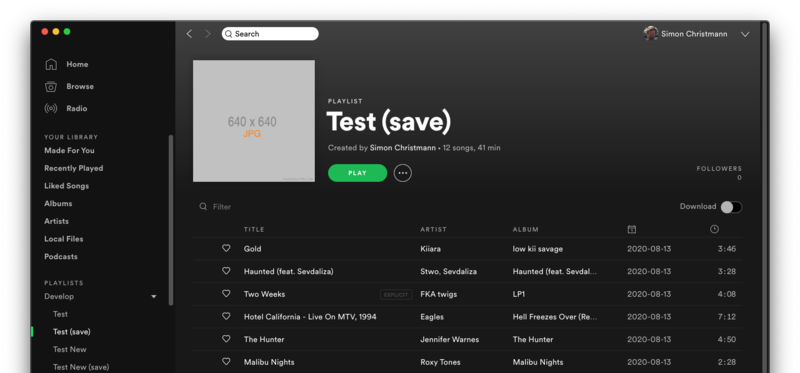

I like to listen to curated playlists because I have no taste and enjoy the ease of just starting one of the official Spotify playlists on random-shuffle. However, sometimes tracks are being removed from these playlists, and sometimes I even liked those tracks.

This script searches once in a while for changes in a source playlist (e.g. "Good Music") and copies all new tracks into a proxy playlist (e.g. "Good Music (save)").

If you absolutely dislike a song, you can remove it from the proxy playlist (e.g. "Good Music (save)") and it will not be re-added on the next cycle.

> :warning: **Use at your own risk.** In case of doubt, check the source code for errors before use.

## Configure

Create `settings.yaml` with a list of playlists that you would like to archive daily:

``` yaml
archiver:
  - Test
  - Test New
  - Not existing Playlist
```

The script will copy new tracks in these playlists to new playlists named `<source playlist name> (save)`, e.g.:

[](docs/spotify.png)

## Usage

### Docker

1) `mkdir -p /opt/spotify-archiver/persistence`
2) Create `/opt/spotify-archiver/settings.yaml`
3) Run with:

```
docker run -d \
    --name spotify-archiver \
    -p 8888:8888 \
    -v /opt/spotify-archiver/settings.yaml:/app/settings.yaml:ro \
    -v /opt/spotify-archiver/persistence:/persistence \
    -e SPOTIFY_ARCHIVER_PERSISTENCE_FILE="/persistence/data.json" \
    -e SPOTIFY_ARCHIVER_REDIRECT_URL="http://<LOCAL_IP_OF_DOCKER_HOST>:8888/callback" \
    -e SPOTIFY_ARCHIVER_CLIENT_ID=<CLIENT_ID> \
    -e SPOTIFY_ARCHIVER_CLIENT_SECRET=<CLIENT_SECRET> \
    dersimn/spotify-archiver
```

> List all possible options with: `docker run --rm dersimn/spotify-archiver --help`

4) Open in a browser <http://LOCAL_IP_OF_DOCKER_HOST:8888/login>

### Native

```
git clone <this repository>
cd spotify-archiver
npm install
```

Create/Edit `settings.yaml`

```
node index -i <CLIENT_ID> -s <CLIENT_SECRET>
```

## To Do

- Copy over description of source playlist
- What to do when source playlist name changes?

## Debug

Development:

    node --unhandled-rejections=strict --trace-deprecation index -i <CLIENT_ID> -s <CLIENT_SECRET> -v debug

Docker development build:

    docker build -t spotify-archiver .
    docker run -it -p 8888:8888 spotify-archiver -i <CLIENT_ID> -s <CLIENT_SECRET> -v debug
    docker run -it --entrypoint bash spotify-archiver

Docker Hub deploy:

    docker buildx create --name mybuilder
    docker buildx use mybuilder
    docker buildx build --platform linux/amd64,linux/arm/v7 -t dersimn/spotify-archiver -t dersimn/spotify-archiver:1.x.0 --push .
